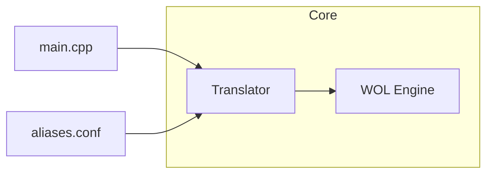

# Plan: Traductor Alias -> MAC (Consulta Directa)

## Resumen

Implementar un módulo de traducción que resuelva nombres ("Alias") a direcciones MAC leyendo **directamente desde un archivo de configuración** en cada consulta. Sin caché en memoria, sin estado global. Wake-on-LAN es un evento eventual, por lo que el overhead de I/O es irrelevante.

## Formato de Configuración

Archivo de texto plano con extensión `.conf`:

```
# Comentario (ignorado)
pc-oficina=AA:BB:CC:DD:EE:01
servidor=F0:E0:D0:C0:B0:A0
impresora=11:22:33:44:55:66
```

- **Líneas vacías** y que comienzan con `#` se ignoran
- **Formato:** `alias=AA:BB:CC:DD:EE:FF`
- **Sin espacios** alrededor del `=`

---

## Arquitectura



### Responsabilidades

| Módulo | Responsabilidad |
|--------|-----------------|
| [`translator.h`](src/core/translator.h) / [`translator.c`](src/core/translator.c) | Función pura que recibe path + alias y retorna la MAC |
| [`wol_engine.h`](src/core/wol_engine.h) | Ya tiene `parse_mac_string()` para convertir "AA:BB:CC:DD:EE:FF" a `uint8_t[6]` |

**No se necesita capa de Ports.** La lectura de archivos es C estándar (`stdio.h`) y portable a todas las plataformas del proyecto.

---

## API Propuesta

### [`translator.h`](src/core/translator.h)

```c
#ifndef TRANSLATOR_H
#define TRANSLATOR_H

#include <stdint.h>

#ifdef __cplusplus
extern "C" {
#endif

/**
 * Resuelve un alias a una dirección MAC leyendo desde un archivo de configuración.
 *
 * @param config_path  Ruta al archivo .conf
 * @param alias        Nombre del dispositivo a buscar
 * @param out_mac      Buffer de 6 bytes para la MAC resultante
 * @return 0 si se encontró, -1 si error o no encontrado
 */
int translator_resolve(const char *config_path, const char *alias, uint8_t *out_mac);

#ifdef __cplusplus
}
#endif

#endif // TRANSLATOR_H
```

**Una sola función.** Sin `init()`, sin `cleanup()`, sin estado global.

---

## Implementación

### Algoritmo de [`translator_resolve()`](src/core/translator.c)

```
1. Abrir archivo con fopen(config_path, "r")
2. Leer línea por línea con fgets()
3. Para cada línea:
   a. Saltar si está vacía o empieza con '#'
   b. Buscar '=' con strchr()
   c. Extraer el alias de la izquierda
   d. Comparar con el alias buscado (strncasecmp para caso insensible)
   e. Si coincide:
      - Extraer el string MAC de la derecha
      - Llamar parse_mac_string() de wol_engine.h
      - Copiar resultado a out_mac
      - Cerrar archivo y retornar 0
4. Si no se encontró, cerrar archivo y retornar -1
```

### Dependencias internas

Solo usa `parse_mac_string()` de [`wol_engine.h`](src/core/wol_engine.h:15), que ya existe en el proyecto.

---

## Estructura de Archivos

```
src/
  core/
    translator.h        <-- API: una función pura
    translator.c        <-- Implementación: lectura directa del archivo
    wol_engine.h        <-- parse_mac_string() ya existente
    wol_engine.c        <-- Motor WOL ya existente
config/
  aliases.conf          <-- Archivo de configuración
tests/
  test_translator.cpp   <-- Pruebas unitarias
```

---

## Flujo de Uso

```c
// En main.cpp o controller:
uint8_t mac[6];
if (translator_resolve("config/aliases.conf", "pc-oficina", mac) == 0) {
    uint8_t packet[102];
    build_magic_packet(mac, packet);
    // ... enviar packet
}
```

---

## Pruebas Unitarias con Catch2

| Prueba | Descripción |
|--------|-------------|
| `resolve_existing_alias` | Alias que existe retorna 0 y MAC correcta |
| `resolve_not_found` | Alias inexistente retorna -1 |
| `resolve_ignore_comments` | Líneas con `#` se ignoran |
| `resolve_ignore_empty_lines` | Líneas vacías se ignoran |
| `resolve_case_insensitive` | "PC-OFICINA" funciona igual que "pc-oficina" |
| `resolve_invalid_file` | Archivo no existente retorna -1 |
| `resolve_invalid_mac` | Formato MAC inválido retorna -1 |
| `resolve_multiple_matches` | Usa la primera coincidencia |

### Archivo de prueba temporal

Crear archivo en directorio temporal para pruebas, limpiar después.

---

## Pasos de Implementación

- [x] **Paso 1:** Definir API en [`translator.h`](src/core/translator.h)
- [ ] **Paso 2:** Implementar [`translator.c`](src/core/translator.c) con lectura directa
- [ ] **Paso 3:** Crear `config/aliases.conf` con datos de ejemplo
- [ ] **Paso 4:** Actualizar [`CMakeLists.txt`](CMakeLists.txt) para incluir `translator.c`
- [ ] **Paso 5:** Escribir `tests/test_translator.cpp` con Catch2
- [ ] **Paso 6:** Compilar y ejecutar pruebas

---

## Consideraciones

| Aspecto | Decisión |
|---------|----------|
| **Estado** | Sin estado global. Función pura con efecto secundario (lectura de disco) |
| **Dependencias** | Solo C estándar + `parse_mac_string()` de wol_engine |
| **Caso** | Búsqueda insensible a mayúsculas con `strncasecmp` |
| **Rendimiento** | Irrelevante para WoL (eventual) |
| **Plataformas** | Windows, Linux, Raspberry Pi, ESP32 |
| **Caracteres alias** | Alfanuméricos + guiones + guión bajo |
